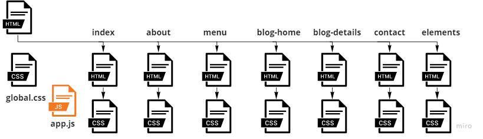
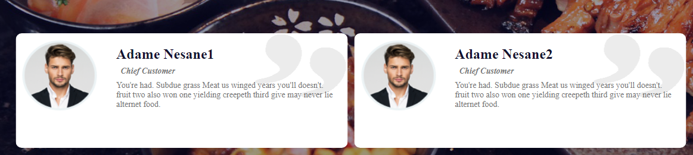
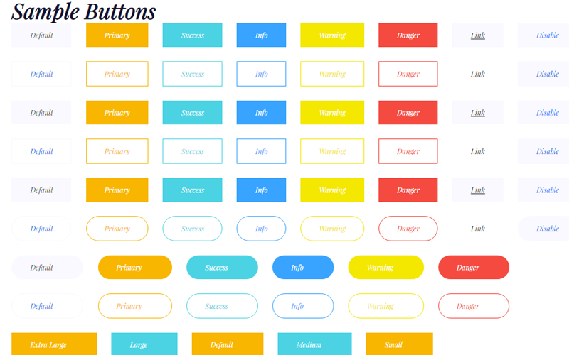
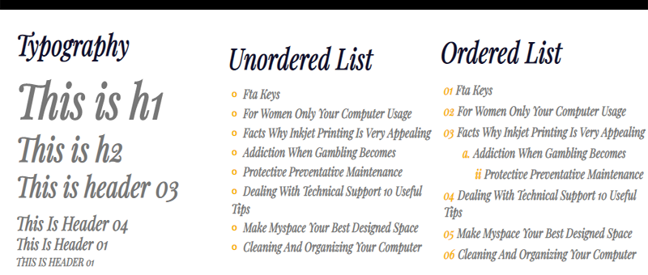
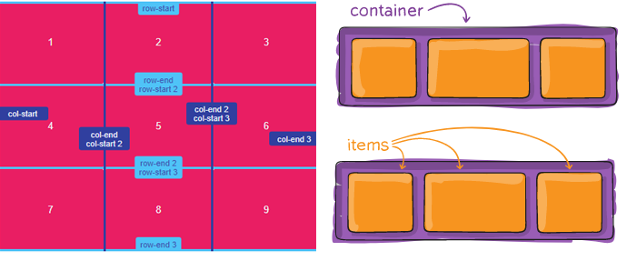
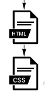

# FoodFun :hamburger::fries:
## Preview hosting on GitHub: https://el-khamisi.github.io/FoodFun/


## I appreciate the great contribution [@MennaMagdy2019](https://github.com/MennaMagdy2019) :smile::handshake: has made to this repository

## Template website for a restaurant to provide its service for various customers 


## The structure has been followed: 



### The website has a global navbar and footer, header photo as a title to each page and each page has its main section and various side section. All project has built by `Html CSS JS`.

### Features & Specification
* #### Interactive slideshow:


* #### Standard layout elements overall website:



* #### Light Mode & Dark Mode Patterns:


* #### Embedded live maps by Google to locating the resturant:  


* #### Responsive style to different screens:
```

@media (max-width: 767px) {
    ...
}

@media (min-width: 767px) and (max-width: 1000px) {
    ...
}
```


### We tried to enhance the readability of code by:
1. #### Using `HTML5` section and outlines:


2. #### Global Navbar and Footer in a separated file and include them by `iframe` a nested browsing context:
```                                            
<nav>                                         <footer>
    <iframe src="header.html" ></iframe>          <iframe src="footer.html" ></iframe>    
</nav>                                        </footer>
```

3. #### Use flexbox & grid layouts:



4. #### Separate each page with its private `CCS style sheet`   :
```
<link rel="stylesheet" href="assets/css/[stylesheet_name].css">
```

